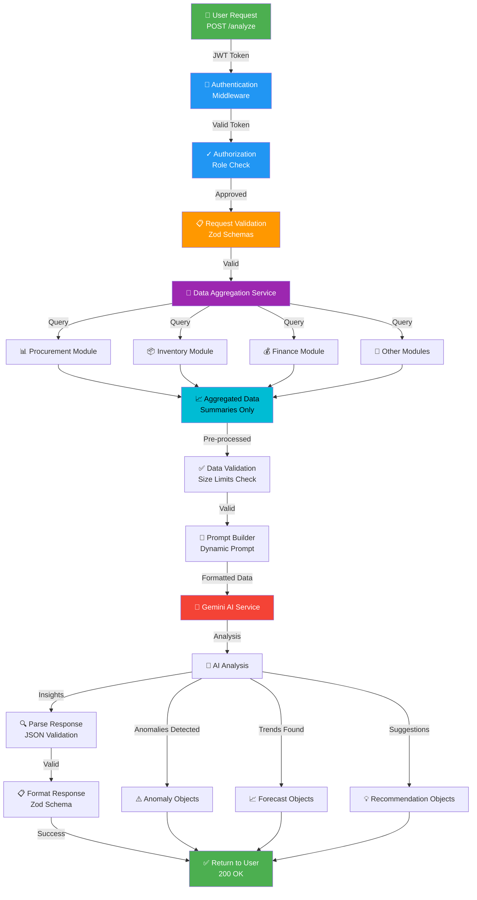

# AI Insights Engine - Architecture Diagram

## Data Flow Explanation

### 1. **Request Phase** (Green) 👤
User sends request with JWT token to analyze business data

### 2. **Authentication Phase** (Blue) 🔐
- Validate JWT token
- Verify user permissions
- Check role-based access control

### 3. **Validation Phase** (Orange) 📋
- Parse request with Zod schemas
- Validate request parameters
- Check date ranges and options

### 4. **Data Aggregation Phase** (Purple) 🔄
- Query all business modules
- Collect spending, inventory, procurement, finance data
- Pre-process and summarize

### 5. **Data Processing Phase** (Cyan) ✅
- Validate aggregated data quality
- Check data size limits (no > 5MB to API)
- Drop raw records, keep summaries only

### 6. **Prompt Engineering Phase** 🎯
Build sophisticated analysis prompt:
```
"Analyze this spending data and provide insights..."
[STRUCTURED INSTRUCTIONS]
[DATA CONTEXT - AGGREGATED ONLY]
[RESPONSE FORMAT - JSON SCHEMA]
```

### 7. **AI Analysis Phase** (Red) 🤖
- Send to Gemini API (no database access by AI)
- AI processes aggregated data only
- Generates insights, anomalies, forecasts, recommendations

### 8. **Response Processing Phase** 📋
- Parse AI response JSON
- Validate against schemas
- Format response object
- Prepare metadata

### 9. **Response Phase** (Green) ✅
Return formatted response with:
- Insights
- Anomalies detected
- Forecasts
- Recommendations
- Health score

---

## Key Principles ✅

### 1. **Security: AI Never Accesses Database**
```
❌ WRONG: AI connects to MongoDB directly
✅ RIGHT: Backend aggregates data → AI analyzes summaries
```

### 2. **Data Isolation**
```
Raw Data (DB)
    ↓ [Pre-process]
Aggregated Summaries
    ↓ [No sensitive details]
Sent to AI
    ↓ [Analysis only]
Return Insights
```

### 3. **Multi-tenant Safety**
```
Each request isolated by:
- User tenant ID
- Automatic filtering
- Isolated queries
- Separate processing
```

### 4. **Role-Based Access**
```
viewer    → Can view summaries
analyst   → Can run all analyses
manager   → Can run analyses + see recommendations
admin     → Full access
```

---

## Component Interaction Map

```
User
  ↓
Routes (9 endpoints)
  ↓
Controllers (9 handlers)
  ↓
InsightEngine
  ├→ DataAggregation
  │   ├→ Procurement queries
  │   ├→ Inventory queries
  │   └→ Finance queries
  ├→ PromptBuilder
  │   └→ Dynamic prompt generation
  └→ GeminiService
      └→ AI analysis

Response
  ↓
Schemas (Validate)
  ↓
Format Output
  ↓
Return to Client
```

---

## Request/Response Example

### Request
```json
{
  "analysisType": "spending",
  "timeRange": {
    "startDate": "2024-01-01",
    "endDate": "2024-01-31"
  },
  "includeForecasts": true,
  "anomalySensitivity": "high"
}
```

### Processing
```
1. Validate request schema ✓
2. Check user auth/role ✓
3. Aggregate spending data from procurement module
4. Format data context (sums only, no details)
5. Build analysis prompt with instructions
6. Send to Gemini AI
7. Receive analysis with insights/anomalies/forecasts
8. Validate response schema ✓
9. Format final response
```

### Response
```json
{
  "success": true,
  "data": {
    "timestamp": "2024-01-31T10:30:00Z",
    "analysisType": "spending",
    "insights": [
      {
        "type": "spending_analysis",
        "title": "Q1 Spending Up 15%",
        "summary": "Monthly spending increased with equipment purchases driving growth",
        "confidence": 0.92
      }
    ],
    "anomalies": [
      {
        "type": "cost_spike",
        "severity": "high",
        "description": "Equipment spending spiked 40%"
      }
    ],
    "summary": {
      "keyFindings": ["15% YoY growth", "High supplier concentration"],
      "overallHealthScore": 78
    }
  }
}
```

---

## Scalability Considerations

### Parallel Requests
- Each request isolated
- No shared state between analyses
- Can handle concurrent requests

### Data Size Management
- Aggregated data summaries (typically < 100KB)
- API limit: 5MB max
- Automatic compression recommended

### Performance Optimization
- Indexed database queries
- Optional caching layer
- Streaming support for large responses

### Security at Scale
- Tenant isolation enforced per request
- Rate limiting per user/tenant
- Audit logging for all operations

---

## Integration Checklist

```
□ Install: npm install @google/generative-ai
□ Env: Set GEMINI_API_KEY
□ Register: registerAIInsightsModule(app)
□ Test: curl /api/v1/insights/health
□ Try: POST /api/v1/insights/analyze
□ Monitor: Check logs and performance
□ Scale: Configure caching/optimization
```

---

## Troubleshooting Guide

| Issue | Cause | Solution |
|-------|-------|----------|
| 401 Unauthorized | Missing JWT | Add Authorization header |
| 403 Forbidden | Wrong role | Verify user role assignment |
| 400 Invalid Request | Bad schema | Check request format against docs |
| 503 Service Unavailable | Gemini API down | Check health endpoint, retry later |
| Slow Response | Large time range | Reduce date range or use /summary |
| Rate Limited | Too many requests | Space out requests, use summary endpoint |

---

## Next: Try It Out

```bash
# 1. Check health
curl http://localhost:3000/api/v1/insights/health

# 2. Get quick summary
curl -X GET 'http://localhost:3000/api/v1/insights/summary?startDate=2024-01-01&endDate=2024-01-31' \
  -H "Authorization: Bearer your-token"

# 3. Full analysis
curl -X POST http://localhost:3000/api/v1/insights/analyze \
  -H "Authorization: Bearer your-token" \
  -H "Content-Type: application/json" \
  -d '{
    "analysisType": "holistic",
    "timeRange": {"startDate": "2024-01-01", "endDate": "2024-01-31"},
    "includeForecasts": true
  }'
```

---

**Architecture Version**: 1.0.0  
**Status**: Production Ready ✅
